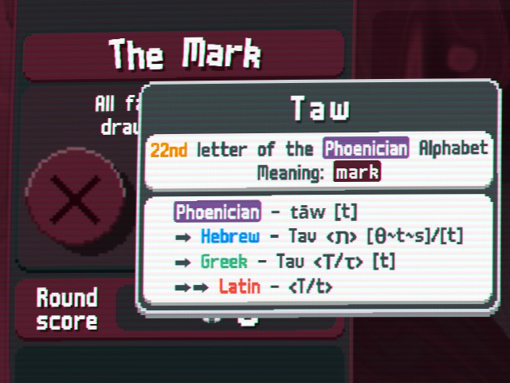
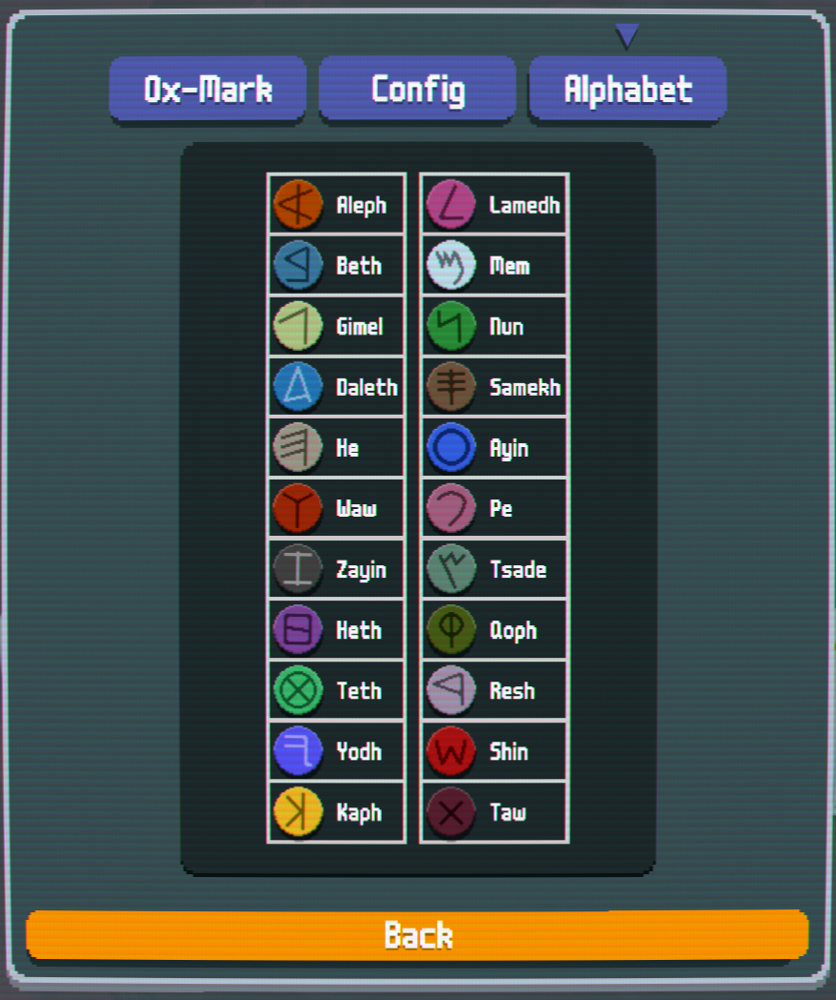

# Ox-Mark

A mod for [Balatro](https://store.steampowered.com/app/2379780/Balatro/) that gives info about the [Phoenician alphabet](https://en.wikipedia.org/wiki/Phoenician_alphabet) using hover-over tooltips on the Blind icons

Extra info for language nerds

## Features

### Blind tooltip

Adds a tooltip to the Blind chip that describes the letter of the [Phoenecian alphabet](https://en.wikipedia.org/wiki/Phoenician_alphabet) written on it. Currently it shows the name, meaning, pronunciation (in [IPA](https://en.wikipedia.org/wiki/Help:IPA)), and descendants in some modern alphabets: [Hebrew](https://en.wikipedia.org/wiki/Hebrew_alphabet), [Greek](https://en.wikipedia.org/wiki/Greek_alphabet), and [Latin](https://en.wikipedia.org/wiki/Latin_script)

The tooltip is also visible in the Collection page by holding shift and hovering over a Blind chip

### Alphabet tab

Arranges the collection Blind chips so that they are in the order of the Phoenician alphabet

Navigate to **Mods** > **Ox-Mark** > **Alphabet**

## Config

* **In-Game Blind Hover**: Whether the tooltip appears when hovering over the Blind chip (see above image)
    * **Disabled**
    * **Enabled**
    * **Enabled (Hold Shift)**: Shift key must be held before hovering over the chip

* **Collection Page Blind Hover**: Whether the Ox-Mark tooltip appears when hovering over the Blind chip in the Collection
    * **Disabled**
    * **Enabled (Hold Shift)**: Shift key must be held before hovering over the chip

# Notes

## Tooltip Details

* Most information about each letter is taken from the [Wikipedia page on the Phoenician Alphabet](https://en.wikipedia.org/wiki/Phoenician_alphabet#Table_of_letters)

* `⮕` indicates that a letter is descended from a previous one, using a tree-like structure. The ones with a singular `⮕` descend from the topmost Phoenician letter, not the line before. Hebrew and Greek alphabets are descended from Phoenician, and Latin alphabet from Greek. `⮕⮕` letters are descended from the most-recent `⮕` one.

* Letter forms are in `<`angle brackets`>`
    * Different forms are separated by `/`
    * Normal and final forms of letters are listed for Hebrew
        * Dotted forms are unable to be displayed
    * Upper, lower, and final forms of letters are listed for Greek
        * `(archaic)` means that a letter is not used in modern Greek
    * Upper and lower forms of letters are listed for Latin

* All pronunciations are in [IPA](https://en.wikipedia.org/wiki/International_Phonetic_Alphabet), in `[`square brackets`]`
    * `∅` indicates a sound is not pronounced, `~` indicates that pronunciation may vary based on dialect or word position, `(ː)` indicates that a letter represents both normal and long vowel sounds
        * For example, not all Hebrew speakers pronounce the glottal stop \[ʔ\]
    * `/` between pronunciations indicates that a letter may have multiple uses
    * `→` between pronunciations indicates that a pronunciation has changed over time (in terms of centuries)

## Sources & Further Reading

* [Wikipedia - Phoenician alphabet](https://en.wikipedia.org/wiki/Phoenician_alphabet#Table_of_letters)
* [Wikipedia - Hebrew alphabet](https://en.wikipedia.org/wiki/Hebrew_alphabet#Pronunciation)
* [Wikipedia - Help:IPA/Hebrew](https://en.wikipedia.org/wiki/Help:IPA/Hebrew)
* [Wikipedia - Greek alphabet](https://en.wikipedia.org/wiki/Greek_alphabet#Letters)
* [Wikipedia - Help:IPA/Greek](https://en.wikipedia.org/wiki/Help:IPA/Greek)
* [Wikipedia - Help:IPA/English](https://en.wikipedia.org/wiki/Help:IPA/English)
